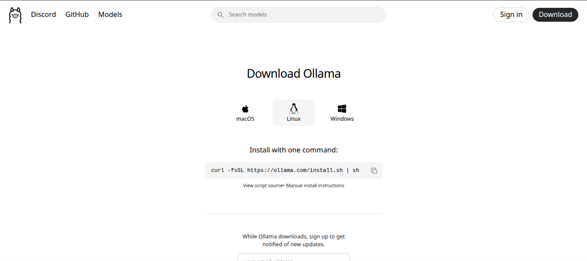
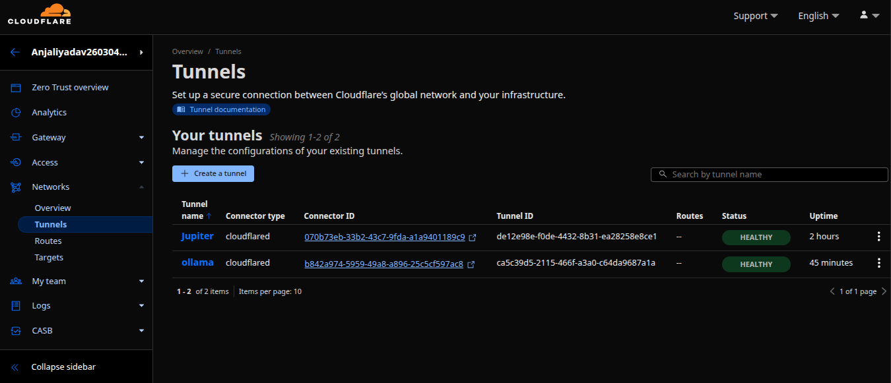

# 🚀 Ollama on Google Colab with Your Own Domain via Cloudflare! 🧠🌐

[](https://ollama.com/)
[Ollama](https://ollama.com)
[](https://www.cloudflare.com/products/tunnel/)
[](https://colab.research.google.com/)

Want to run powerful open-source AI models like Llama 3 or Phi-3 on a **free (or Pro) Google Colab instance** and access them from anywhere using your **own custom domain**? This guide is for you! We'll use Ollama for the AI models and Cloudflare Tunnel for secure, easy remote access.

Get ready to have your private AI assistant on `ollama.yourdomain.com`, powered by Colab! 😎

---

## ✨ Why Colab + Ollama + Cloudflare?

* **Cost-Effective Compute:** Leverage Google Colab's free (or affordable Pro) GPU/TPU resources.
* **Your Own AI Endpoint:** Run the specific Ollama models you need.
* **Custom Domain Access:** Use a memorable domain, not a temporary Colab URL.
* **Secure Connection:** Cloudflare Tunnel protects your Colab instance from direct internet exposure.
* **Easy Setup:** Relatively straightforward steps to get up and running.

---

## 🛠️ Core Components

1.  **Google Colab:** Provides the runtime environment (notebook) to install and run Ollama.
2.  **Ollama:** ([ollama.com](https://ollama.com/)) Runs the large language models within Colab.
3.  **Cloudflare Tunnel:** ([Cloudflare Zero Trust](https://www.cloudflare.com/products/zero-trust/tunnel/)) Creates the secure link between your Colab Ollama instance and the internet via your custom domain.

---

## 🚀 Setup Workflow: Colab Edition!

Follow these main stages: First, set up Cloudflare, then configure your Colab notebook.

### Part 1: Cloudflare Configuration (Done on the Cloudflare Website ☁️)

1.  **Create a Cloudflare Account & Add Your Domain:**
    * If you haven't already, sign up for Cloudflare and add your custom domain.

2.  **Navigate to Zero Trust & Create a Tunnel:**
    * In your Cloudflare dashboard, go to `Zero Trust`.
    * Under `Access`, click on `Tunnels`.
    * Click `+ Create a tunnel`.
    * Choose `Cloudflared` as the connector type, then click `Next`.

3.  **Name Your Tunnel:**
    * Give your tunnel a descriptive name (e.g., `ollama-colab`).
    * Click `Save tunnel`.
    
    *(Focus on the "Tunnel name" field in the image above for this step)*

4.  **Get Your Tunnel Token:**
    * After saving, you'll be presented with installation instructions for `cloudflared`. **Crucially, you need the tunnel token.** It will be part of a command like `cloudflared.exe service install YOUR_TOKEN_HERE` or `cloudflared tunnel run --token YOUR_TOKEN_HERE TUNNEL_NAME_OR_ID`.
    * **COPY THIS TOKEN!** 📋 You'll need it in your Colab notebook.

5.  **View Your Tunnel:**
    * Your newly created tunnel will now appear in the Tunnels dashboard.
    

6.  **Configure a Public Hostname for the Tunnel:**
    * Select your tunnel from the list, then click `Configure`.
    * Go to the `Public Hostnames` tab and click `+ Add a public hostname`.
    * **Subdomain:** e.g., `ollama`
    * **Domain:** Select your domain (e.g., `yogeshvibez.dpdns.org` from your image).
    * **Service Type:** `HTTP`
    * **URL:** `localhost:11434` (Ollama's default port).
    * Click `Save hostname`.
    

### Part 2: Google Colab Setup (In Your Notebook 📒)

Now, open a new Google Colab notebook and run the following cells:

1.  **Install Ollama:**
    This command downloads and installs Ollama in your Colab environment.
    ```python
    !curl -fsSL [https://ollama.com/install.sh](https://ollama.com/install.sh) | sh
    ```
    *(This command is sourced from the official Ollama website as shown below)*
    

2.  **Set Ollama Environment Variables:**
    To allow connections from the Cloudflare tunnel.
    ```python
    import os
    os.environ['OLLAMA_HOST'] = '0.0.0.0'
    os.environ['OLLAMA_ORIGINS'] = '*'
    ```

3.  **Start Ollama Server & Pull a Model:**
    This starts the Ollama server in the background (`&`) and then downloads a model (e.g., `phi3`). Replace `phi3` with your desired model.
    ```python
    !ollama serve & ollama pull phi3
    ```
    *Wait for the model to download completely. You'll see progress in the cell output.*

4.  **Install Cloudflared:**
    This downloads and installs the Cloudflared agent in Colab.
    ```python
    !wget [https://github.com/cloudflare/cloudflared/releases/latest/download/cloudflared-linux-amd64.deb](https://github.com/cloudflare/cloudflared/releases/latest/download/cloudflared-linux-amd64.deb)
    !sudo dpkg -i cloudflared-linux-amd64.deb
    !cloudflared --version
    ```

5.  **Run the Cloudflared Tunnel:**
    Replace `YOUR_TUNNEL_TOKEN_HERE` with the token you copied from the Cloudflare dashboard in Part 1, Step 4.
    ```python
    !cloudflared tunnel --no-autoupdate run --token YOUR_TUNNEL_TOKEN_HERE
    ```
    *This cell must remain running for the tunnel to stay active!* It will output connection details.

---

## ✅ Success! Accessing Your Ollama Instance

Once the Colab cells are running and Cloudflare is configured:

1.  **Access via Your Custom Domain:**
    Open a browser and go to the public hostname you set up (e.g., `https://ollama.yogeshvibez.dpdns.org`). You might see a simple "Ollama is running" message or a similar confirmation if you access the base URL (Ollama primarily serves API requests).
    

2.  **Check Ollama Logs in Colab (for API requests):**
    When you send an API request (see next section), the output of the `!ollama serve & ...` cell in Colab should show activity, similar to the server logs indicating a request was processed.
    *(The image below shows a generic Ollama server log, which you would see parts of in your Colab output cell when a request like `/api/generate` is made)*
    

---

## 💬 Example: Chatting with Your AI via Colab

Use `curl` from your local machine's terminal (or any API client) to send requests to your Ollama instance running on Colab, through your custom domain.

Replace `https://ollama.yogeshvibez.dpdns.org` with your actual Cloudflare public hostname and `phi3` with your chosen model.

```bash
curl [https://ollama.yogeshvibez.dpdns.org/api/generate](https://ollama.yogeshvibez.dpdns.org/api/generate) -d '{
  "model": "phi3",
  "prompt": "Why is the sky blue? Explain it like I am five.",
  "stream": false
}'
